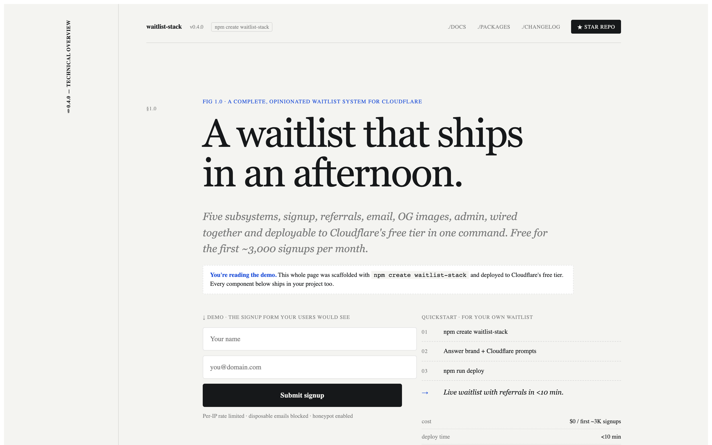
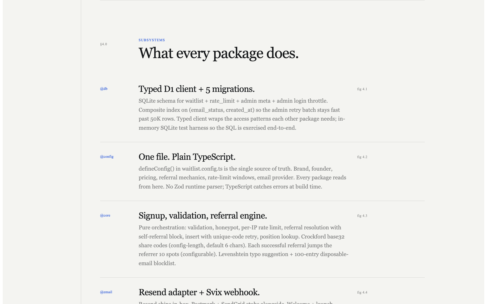
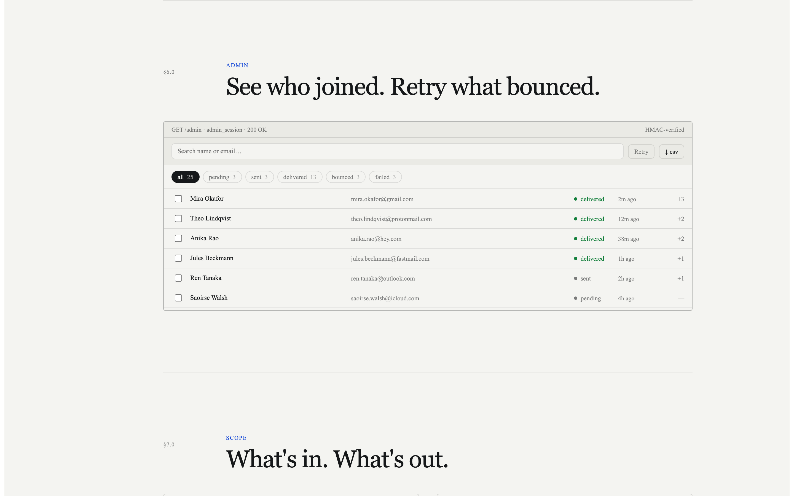

# waitlist-stack

[](https://github.com/Giri-Aayush/waitlist-stack/actions/workflows/ci.yml) [](LICENSE)

A complete, MIT-licensed waitlist template for Cloudflare. Signup, referrals, transactional email, edge-cached OG images, password-gated admin, SEO + llms.txt, anti-fraud. Deploy in under 30 minutes for $0.



```sh
npm create waitlist-stack@latest my-waitlist
```

That's it. The wizard prompts for your brand, founder details, and Cloudflare account, writes a fully populated project, and prints the four commands to deploy.

> **Pre-release note (remove once `@waitlist-stack/*` packages are published to npm):** the wizard's scaffolded project depends on `@waitlist-stack/{db,config,core,email,og,seo,admin}` from npm. Until those are published, the scaffolded project's `npm install` will fail to resolve them. To try the template in the meantime, clone this repo and `cd apps/example && pnpm install && pnpm dev`.

## Have an AI agent walk you through this

If terminal commands aren't your thing, copy the prompt below into Claude, ChatGPT, Cursor, or any agent that can fetch URLs. It will read this README, the setup docs, and the relevant code, then guide you step-by-step from a clean machine to a live deployment with your brand on it.

```
I want to deploy waitlist-stack, a free, MIT-licensed waitlist template
that runs on Cloudflare's free tier:
https://github.com/Giri-Aayush/waitlist-stack

Treat me as a non-expert solo founder. Walk me through, pausing and
confirming with me between each step:

1. What this gives me out of the box, in plain English (what does
   "signup form + referrals + email + OG images + admin dashboard"
   actually mean for my product?).
2. The accounts I need to sign up for before I can deploy
   (Cloudflare, Resend, GitHub) and roughly how much time each takes.
3. The exact commands to run, in order, from `npm create
   waitlist-stack` through `npm run deploy`.
4. How to customize the design once it's running: what files to edit,
   what to ask Claude Code to do for me, where the brand colors live.
5. Common errors I'll hit and how to fix them (Resend domain
   verification, wrangler login, D1 migration order).

Use the README at
https://raw.githubusercontent.com/Giri-Aayush/waitlist-stack/main/README.md
as the source of truth. If you need more depth on a topic, fetch the
relevant file from the repo (CONTRIBUTING.md, the RESEND_SETUP.md
inside apps/example/, per-package code).

When we're done, I should have a live waitlist on Cloudflare with my
brand, accepting signups, and sending welcome emails.
```

## Why this exists

Every solo founder validating an idea rebuilds the same stack from scratch. Signup form, referral math, transactional email, OG image generation, an admin to look at signups. It takes a week. It costs $20-50/month from day one (Vercel + Postgres + S3 + a transactional email service). It's the time-and-money tax on idea validation.

This template removes both. The full stack runs on Cloudflare's free tier:

- **Database**: D1 (SQLite, 5 GB / 5M reads per day)
- **Object storage**: R2 (10 GB / 1M class A ops per month, used for OG image cache)
- **Compute**: Workers (100K req/day) via `@opennextjs/cloudflare`
- **Email**: Resend (100/day, 3K/month) — the one non-Cloudflare dep, kept because there's no good Cloudflare-native transactional email yet

The free tiers comfortably cover ~3K signups per month. Enough to validate any product before any real revenue exists.

## What you get

Eight subsystems, each in its own package, each independently forkable:

| Package | What it does |
|---|---|
| [`packages/db`](packages/db/) | D1 schema (5 migrations), typed client, in-memory test harness |
| [`packages/config`](packages/config/) | Plain TS product config schema (`defineConfig` helper) |
| [`packages/core`](packages/core/) | Signup orchestration, Crockford base32 referral codes, position math (window function), Levenshtein typo suggestion + 100-entry disposable email blocklist, sliding-window rate limit |
| [`packages/email`](packages/email/) | Resend adapter (Postmark + SendGrid stubs alongside), parameterized templates, Svix webhook verification |
| [`packages/og`](packages/og/) | Brand-tokenized OG cards, R2 cache keyed by referral state, renderer-agnostic handler |
| [`packages/seo`](packages/seo/) | JSON-LD blocks (Organization, WebSite, SoftwareApplication), llms.txt generator, robots, sitemap, dynamic favicon |
| [`packages/admin`](packages/admin/) | Signed-cookie auth (Web Crypto), DB-backed session-version revoke, login rate limit, middleware |
| [`packages/create-waitlist-stack`](packages/create-waitlist-stack/) | The CLI wizard |

Plus [`apps/example`](apps/example/) — a deploy-ready Next.js 15 app wired to all the packages, with a polished landing the wizard scaffolds from.



## Quickstart

```sh
npm create waitlist-stack@latest my-waitlist
cd my-waitlist
npm install
npm run dev    # http://localhost:3000
```

To deploy:

```sh
npx wrangler login
npx wrangler d1 create my-waitlist            # paste the id into wrangler.jsonc
npx wrangler r2 bucket create my-waitlist-og
npx wrangler d1 migrations apply my-waitlist --remote
npm run deploy
```

The wizard generates a `CLAUDE.md` in your scaffolded project that briefs Claude Code on where everything lives. To customize the design: open the project in Claude Code and ask. The theme tokens are in `lib/theme.ts`; the landing composition is in `components/PaperLanding.tsx`.

## How it works

Each feature has a one-line plain-English summary plus an *under the hood* note for the curious.

**Signup form that's hard to abuse.** Drop name + email, hit submit, you're on the list. The form catches honeypot bots, blocks disposable email services (mailinator, 10minutemail, etc.), rate-limits one IP from spamming you, and politely suggests typo fixes ("did you mean `gmail.com`?").
> Under the hood: `POST /api/waitlist` runs validation, honeypot check, per-IP sliding-window rate limit, referral resolution with self-referral block, insert with unique-code retry, then a position lookup. Welcome email fires in best-effort mode; failures land in `email_status='failed'` for the admin retry batch.

**Referrals that actually work.** Every signup gets a unique link like `your-site.com/?ref=K7M9P3`. When someone signs up through that link, the original person jumps 10 spots in the queue. The position they see updates live as their friends join.
> Under the hood: position is recomputed from the full table via a SQLite window function (rank by `created_at`, subtract `referral_count * jumpsPerReferral`, tiebreak by id), so other people's referrals correctly shift you down.

**OG cards that show the user's name + position.** When someone shares their referral link to Twitter, Slack, iMessage, or LinkedIn, the preview shows *"Mira just got on the Acme waitlist · #1247"* instead of a generic logo. Way more clickable.
> Under the hood: `/api/og?ref=CODE` returns a personalized 1200×630 PNG. Cached in R2 keyed by `<code>:<position>:<referralCount>` so a referral bump invalidates the image automatically. Generic fallback (no DB lookup) for missing or invalid refs as a denial-of-cost defense.

**Admin dashboard you can actually log into.** Password-gated page that lists every signup. Filter by status (delivered / bounced / failed / queued), search by name or email, retry any failed welcome email with one click, export the whole list to CSV.



> Under the hood: `/admin` is gated by signed cookies (HMAC-SHA256 over `<issuedMs>.<sessionVersion>`). Three-tier verification: cheap edge HMAC check in middleware, full DB-backed version check inside every page, and the same `requireAdminOrRedirect()` guard runs on every server action — a route matcher misconfig can't leak data. Bumping the DB session-version row invalidates every active cookie at once (the logout flow). Dashboard surface: search box, status filter chips with a synthetic `queued` = pending+failed combo, color-coded statuses with attempt counts, inline error tooltips, per-row retry button, batch retry that surfaces *"X/Y sent · errors · hit provider rate limit"*, CSV export respecting current filter + search.

**Transactional email that survives provider hiccups.** Welcome emails go out via Resend right after signup. If Resend rate-limits you (free tier is 100/day), the row is marked `failed` and you can batch-retry later from the admin — without burning more attempts during the 429.
> Under the hood: Resend webhook (Svix-signed) flips rows to `delivered` / `bounced` / `failed`. Batch retry pulls the latest 100 pending/failed, re-looks-up each row's current position so retried emails reflect the live queue, short-circuits the loop on a 429 from Resend.

**Live "you're #N" updates without an account.** After someone signs up, their position updates in real time as friends join — no login required, no polling your DB inefficiently.
> Under the hood: `GET /api/waitlist/me/{code}` returns the live `{position, baseRank, referralCount}` for a referral code. Knowing a code reveals position only — not name or email — and codes are 6-char Crockford base32 (~10⁹ keyspace), so brute enumeration isn't economic against a small list.

**CSV export with everything.** One click in the admin. Includes name, email, source, status, attempts, last error, referral code + count, timestamps. Filter-aware (export only the bounces, only the queued, etc.).
> Under the hood: `GET /admin/export.csv?q=&status=` is auth-gated (returns 401 not a redirect, so download clients fail loudly). RFC 4180-quoted, plus a leading-quote guard against formula injection — a name like `=cmd|...` is neutralized before Excel can execute it.

**SEO + answer-engine discoverability.** JSON-LD blocks (Organization, WebSite, SoftwareApplication with priced offers) so Google's rich results work. Auto-generated `llms.txt` so Perplexity, ChatGPT, and Claude can quote your brand correctly when users ask about you.
> Under the hood: all driven from `waitlist.config.ts`. robots, sitemap, favicon, OG meta, Twitter card all read the same brand object.

---

**Tested.** 124 unit tests across the six backend packages cover the load-bearing correctness: position math (including the regression where other people's referrals must shift you down), referral code generation, email validation + Levenshtein typo suggestion, signup orchestration with the wired-through honeypot, Svix webhook signature verification (tampered body / wrong secret / multi-signature) plus replay-window rejection, webhook event routing, signed-cookie roundtrip with version revoke, login rate-limit window logic, JSON-LD founder-name passthrough.

## Security

- Open-redirect guarded at the admin login: only strictly-relative paths accepted for `?next=`.
- Admin auth: signed cookies (HMAC-SHA256), DB-backed session-version revoke, edge HMAC + handler-level full check, login rate limit, and a min-length guard so a typo'd 1-char `ADMIN_PASSWORD` fails closed.
- Email webhook: Svix signature + 5-minute replay window (per Svix spec) so captured events can't be replayed later.
- CSV export: auth-gated (401, not redirect), formula-injection-safe (leading-quote guard for `=+-@` etc.), hard-capped at 50k rows so a viral list can't OOM the worker.
- Honeypot field is `website_url` (not the obvious `company`/`url`) and is wired through React state into the signup body, so bots that auto-fill known honeypot names trip it instead of skipping it.

Found a vulnerability? See [SECURITY.md](SECURITY.md) for the disclosure email and scope.

## What this is NOT

- **Not a SaaS replacement**. If you need multi-tenant accounts, payment processing, or anything beyond a pre-launch waitlist, build that separately. This is for the validation phase.
- **Not a hosted product**. You deploy it. There's no "waitlist.cloud" you sign up for. The whole point is you own your data and have no monthly bill until you outgrow the free tier.
- **Not a no-code tool**. You'll edit a config file and (optionally) tweak the landing. Vibecoder DX is the goal; zero coding is not.
- **Not opinionated about your design**. The default landing is a Stripe-Press-style "technical paper" look. Swap it for whatever you want via Claude Code or hand-edits. The backend doesn't care.
- **Not multi-region**. D1 is single-region; reads from other regions go through Cloudflare's network. Fine for a waitlist; not fine for low-latency global reads at scale.
- **Not a referral fraud system**. Honeypot + per-IP rate limit + disposable email blocklist + self-referral block catch the obvious abuse. Sophisticated fraud (residential proxy farms, real human gig workers) needs more.

## Stack

- Next.js 15 (App Router) on `@opennextjs/cloudflare`
- React 19, TypeScript 5.7 strict
- pnpm 10 + Turborepo workspaces
- vitest with an in-memory SQLite test harness for D1 (real schema, real queries, fast)
- workers-og for OG rendering (Satori + Yoga + Resvg as WASM)
- Resend for email (Postmark + SendGrid adapter stubs included)

## Contributing

PRs welcome. The Postmark and SendGrid email provider stubs are good first issues — both have a `// PRs welcome` comment with the exact API shape. See [CONTRIBUTING.md](CONTRIBUTING.md).

## License

MIT. See [LICENSE](LICENSE).
